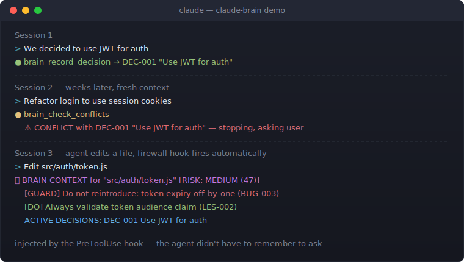

<div align="center">

```
     ██████╗██╗      █████╗ ██╗   ██╗██████╗ ███████╗
    ██╔════╝██║     ██╔══██╗██║   ██║██╔══██╗██╔════╝
    ██║     ██║     ███████║██║   ██║██║  ██║█████╗
    ██║     ██║     ██╔══██║██║   ██║██║  ██║██╔══╝
    ╚██████╗███████╗██║  ██║╚██████╔╝██████╔╝███████╗
     ╚═════╝╚══════╝╚═╝  ╚═╝ ╚═════╝ ╚═════╝ ╚══════╝
    ██████╗ ██████╗  █████╗ ██╗███╗   ██╗
    ██╔══██╗██╔══██╗██╔══██╗██║████╗  ██║
    ██████╔╝██████╔╝███████║██║██╔██╗ ██║
    ██╔══██╗██╔══██╗██╔══██║██║██║╚██╗██║
    ██████╔╝██║  ██║██║  ██║██║██║ ╚████║
    ╚═════╝ ╚═╝  ╚═╝╚═╝  ╚═╝╚═╝╚═╝  ╚═══╝
```

**Autonomous context management for AI coding agents**

**Never explain your project twice.** The agent starts every session already knowing
the decisions, the bugs, the conventions — and its own past mistakes.
Persistent project memory + cognitive firewall + tree-sitter code graph, exposed as 53 MCP tools.

[](https://opensource.org/licenses/MIT)
[](https://nodejs.org)
[](https://modelcontextprotocol.io)

[](https://github.com/Xattaus/claude-brain/actions/workflows/ci.yml)


</div>

---

## The Problem

AI coding agents have two fundamental limitations:

**1. No memory between sessions.** Every session starts from zero.

```
Session 1:  "Let's use JWT for auth"     ─── decision made
Session 2:  "Let's use session cookies"  ─── decision contradicted
Session 3:  "Why is auth broken?"        ─── bug reintroduced
```

**2. Context fills up within a session.** As the conversation grows, early decisions get compressed or evicted. The bigger the project, the faster critical information drowns in noise.

## The Solution

Claude Brain is an MCP server that gives the agent a **structured, queryable knowledge base** plus a **code structure graph** — so instead of stuffing everything into the context window, the agent retrieves exactly what's relevant, when it's relevant.

<div align="center">

</div>

Three subsystems:

| Subsystem | What it does |
|:----------|:-------------|
| **Project memory** | Decisions, bugs, implementations, patterns, lessons, plans, and research stored as Markdown + YAML in `.brain/`, linked into a typed knowledge graph |
| **Cognitive firewall** | Pre-edit risk scoring (`brain_preflight`) and post-edit validation (`brain_validate_change`) backed by rules extracted from lessons and bugs |
| **Code graph** | Tree-sitter AST parsing (JS / TS / Python / Rust) into a graphology graph: symbols, calls, imports, communities, blast radius, god nodes |

## Quick Start

```bash
git clone https://github.com/Xattaus/claude-brain.git
cd claude-brain && npm install

# Install into your project
node install.js /path/to/your/project
```

Restart Claude Code. The installer sets up everything the agent needs:

- **`.mcp.json`** in the project root — registers the brain MCP server (this is the file Claude Code actually reads; older versions wrote to `settings.local.json`, which Claude Code ignores — the installer migrates that automatically)
- **`CLAUDE.md` / `GEMINI.md`** — workflow instructions for the agent (when to record, when to check conflicts, how to use the code graph)
- **Hooks** — SessionStart context injection, PreToolUse firewall check before file edits, PostToolUse documentation reminders, Stop-time "did you save?" check, PreCompact context preservation
- **Skills + agents** — brain-workflow skill, curator/documenter/reviewer/backlog maintenance agents
- **Permissions** — `mcp__brain__*` allowed so tool calls don't prompt

Verify with `claude mcp list` — you should see `brain: ✔ Connected`.

## Designed for Autonomy

This is not a note-taking app with an API. Every piece exists so the agent uses the brain **without being asked**:

1. **Session start** — SessionStart hook injects the overview; the agent calls `brain_get_overview` + `brain_get_lessons` and knows the project's history and its own past mistakes.
2. **Before an edit** — PreToolUse hook reads `.brain/index.json` directly and injects matching rules, related decisions, open/fixed bugs, and a risk score into the agent's context — even if the agent forgot to call `brain_preflight`.
3. **After an edit** — PostToolUse hook reminds the agent to record significant changes. An activity counter nudges after 10 consecutive non-brain tool calls.
4. **On mistakes** — the agent records a lesson with a concrete rule; the rule is indexed and enforced by the firewall on every subsequent edit of those files.
5. **At stop** — the Stop hook blocks once and asks the agent to verify everything was saved.

## Cognitive Firewall

```
                    ┌─────────────────────┐
                    │   Agent wants to    │
                    │   edit a file       │
                    └─────────┬───────────┘
                              ▼
                    ┌─────────────────────┐
                    │  brain_preflight()  │
                    │   rules + bugs +    │
                    │  lessons + conflicts│
                    └─────────┬───────────┘
                 ┌────────────┼────────────┐
                 ▼            ▼            ▼
           ┌──────────┐ ┌──────────┐ ┌──────────┐
           │ LOW  <40 │ │ MED 40-69│ │ HIGH ≥70 │
           │ Proceed  │ │ Careful  │ │ STOP +   │
           └──────────┘ └──────────┘ │ ask user │
                                     └──────────┘
```

After edits, `brain_validate_change()` checks nothing was violated. Rules come in three flavors: `DO` (requirements), `DONT` (prohibitions), `GUARD` (fixed bugs that must not be reintroduced).

## Code Graph

`brain_code_build` parses the project with tree-sitter WASM grammars and builds a directed multigraph of files, classes, functions, and methods with `contains` / `calls` / `imports` / `inherits` edges, Louvain community detection, and per-file AST caching.

```
brain_code_query("auth middleware")   → IDF-ranked subgraph, token-budgeted for context
brain_code_blast(["src/util.js"])     → affected nodes, communities, risk score
brain_code_path("a.js", "b.js")       → shortest dependency path
brain_code_gods()                     → over-connected symbols (refactoring candidates)
brain_code_surprises()                → unexpected cross-module / cross-language edges
brain_bridge_auto()                   → links brain entries to the code nodes they describe
```

Supported languages: **JavaScript, TypeScript, Python, Rust**. The bridge layer connects the two graphs — a decision about `auth.js` is linked to the actual `auth.js` nodes, so file-level context retrieval pulls both prose and structure.

## 53 MCP Tools

<details>
<summary><b>Core — Query & Discovery</b> <kbd>5</kbd></summary>

| Tool | What it does |
|:-----|:-------------|
| `brain_get_overview` | Project overview + active decisions + open bugs. Call at session start. |
| `brain_search` | Full-text search (MiniSearch + TF-IDF) with relevance ranking |
| `brain_get_entry` | Retrieve a single entry by ID with content and relationships |
| `brain_list` | List entries filtered by type, status, and tags |
| `brain_get_lessons` | Active lessons grouped by severity, with their rules |

</details>

<details>
<summary><b>Recording — Capture Knowledge</b> <kbd>6</kbd></summary>

| Tool | What it does |
|:-----|:-------------|
| `brain_record_decision` | Architecture decisions in ADR format (supports `supersedes`) |
| `brain_record_bug` | Bug fixes with symptoms, root cause, and fix |
| `brain_record_implementation` | Implementation details and code changes |
| `brain_record_pattern` | Reusable patterns and conventions |
| `brain_record_lesson` | Lessons from mistakes with rules to prevent recurrence |
| `brain_record_research` | Explored alternatives, rejections, and conclusions |

</details>

<details>
<summary><b>Context & Relationships</b> <kbd>5</kbd></summary>

| Tool | What it does |
|:-----|:-------------|
| `brain_link_entries` | Bidirectional typed links (`implements`, `fixes`, `supersedes`, …) |
| `brain_get_context_for_files` | All decisions, bugs, implementations for specific files |
| `brain_traverse_graph` | Navigate the knowledge graph — traverse, paths, impact, cycles |
| `brain_check_conflicts` | Does a proposed change conflict with existing decisions? |
| `brain_get_history` | Change log of all brain operations |

</details>

<details>
<summary><b>Cognitive Firewall</b> <kbd>3</kbd></summary>

| Tool | What it does |
|:-----|:-------------|
| `brain_preflight` | Pre-edit risk assessment: rules + conflicts + lessons + regression risks |
| `brain_validate_change` | Post-edit validation against DO/DONT/GUARD rules |
| `brain_rebuild_rules` | Re-extract the firewall rule index from all entries |

</details>

<details>
<summary><b>Planning & Sessions</b> <kbd>4</kbd></summary>

| Tool | What it does |
|:-----|:-------------|
| `brain_record_plan` | Session plans with scope, implemented and deferred items |
| `brain_update_plan` | Update plan status, complete items, add next steps |
| `brain_get_backlog` | Incomplete plans sorted by priority |
| `brain_get_session_summary` | Everything recorded this session (use before /compact) |

</details>

<details>
<summary><b>Environment & Sync</b> <kbd>3</kbd></summary>

| Tool | What it does |
|:-----|:-------------|
| `brain_sync` | Sync brain entries from superpowers-style docs |
| `brain_get_environment` | Available MCP servers, skills, and agents |
| `brain_scan_environment` | Re-scan and persist the environment |

</details>

<details>
<summary><b>Maintenance</b> <kbd>9</kbd></summary>

| Tool | What it does |
|:-----|:-------------|
| `brain_update_entry` | Update status, title, content, or relations of an entry |
| `brain_review_entry` | Mark entry as reviewed without changing content |
| `brain_health` | Stale entries, orphans, broken links |
| `brain_rebuild_index` | Rebuild index.json from entry files (corruption recovery) |
| `brain_get_metrics` | Tool call counts, entries created, activity |
| `brain_create_snapshot` | Backup the brain state |
| `brain_list_snapshots` | List available snapshots |
| `brain_restore_snapshot` | Restore a snapshot (backs up current state first) |
| `brain_update` | Upgrade the brain installation to the latest version |

</details>

<details>
<summary><b>Advanced</b> <kbd>4</kbd></summary>

| Tool | What it does |
|:-----|:-------------|
| `brain_mine_sessions` | Extract context from past Claude Code session logs |
| `brain_auto_document` | Find undocumented git commits and suggest entries |
| `brain_coordinate_team` | Generate a maintenance run-list for the bundled agents |
| `brain_visualize` | Open the knowledge graph in a browser |

</details>

<details>
<summary><b>Code Graph</b> <kbd>14</kbd></summary>

| Tool | What it does |
|:-----|:-------------|
| `brain_code_build` | Build/rebuild the graph (tree-sitter, cached per file) |
| `brain_code_query` | IDF-weighted search, token-budgeted output |
| `brain_code_node` | Node details with neighbors |
| `brain_code_neighbors` | Incoming/outgoing edges for a node |
| `brain_code_path` | Shortest path between two symbols |
| `brain_code_community` | Nodes in a detected community |
| `brain_code_stats` | Nodes, edges, languages, types |
| `brain_code_blast` | Blast radius + risk score for changed files |
| `brain_code_gods` | Over-connected nodes (P99 degree) |
| `brain_code_surprises` | Unexpected cross-community/cross-language edges |
| `brain_code_health` | Is the graph built and fresh? |
| `brain_code_visualize` | Open the code graph in a browser |
| `brain_bridge` | Manually link a brain entry to code nodes |
| `brain_bridge_auto` | Auto-detect entry ↔ code links |

</details>

## How It's Stored

```
.brain/
├── overview.md              Project description (auto-generated, overridable)
├── index.json               Fast lookup index + firewall rules
├── text-index.json          Persisted full-text search index
├── decisions/               DEC-001-use-jwt.md … (ADR format)
├── implementations/         What was built and how
├── bugs/                    Symptoms, root causes, fixes
├── patterns/                Reusable conventions
├── lessons/                 Mistakes + rules that prevent them
├── plans/                   Session plans and deferred tasks
├── research/                Alternatives explored and rejected
├── snapshots/               Point-in-time backups
├── code-graph/              graph.json, communities, analysis, AST cache
└── history/changelog.md     Full change log
```

Plain Markdown + YAML frontmatter — human-readable, git-diffable, no database. Writes are file-locked (proper-lockfile) and the index is written atomically.

## CLI

The brain also works from the command line without an agent:

```bash
node cli.js overview                                  # project overview
node cli.js search "authentication"                   # full-text search
node cli.js read DEC-001                              # read single entry
node cli.js check "Switch JWT to session cookies"     # conflict check
node cli.js decide "Use Postgres" "Need RDBMS" "v14"  # record decision
node cli.js link IMPL-005 DEC-002 implements          # link entries
node cli.js visualize                                 # browser graph view
```

The visualizer (`brain_visualize` / `brain_code_visualize` / `node cli.js visualize`) serves a canvas-based force-directed view of either graph. It's a convenience for humans inspecting what the agent has accumulated — the agent itself uses the query tools, not the visualizer.

## Testing

```bash
npm test          # 280 tests across 6 suites (node:test, no test deps)
```

Suites: core brain operations, knowledge graph traversal, Zod validation, MCP handlers, library internals, performance benchmarks. The code-graph subsystem has its own suite under `tests/code-graph/`.

## Project Structure

```
claude-brain/
├── mcp-server.js            MCP server — 53 tools
├── install.js               Installer: .mcp.json, hooks, skills, agents, CLAUDE.md
├── mcp-installer.js         brain-installer MCP server (install via tool call)
├── cli.js                   Command-line interface
├── visualize.js             Browser visualizer (brain + code graph)
├── lib/
│   ├── brain-manager.js     CRUD, locking, index, snapshots
│   ├── handlers/            Tool handlers by category (core, recording, safety, …)
│   ├── code-graph/          scan → extract (tree-sitter) → build → cluster → analyze
│   │   ├── languages/       JS / TS / Python / Rust configs
│   │   └── wasm/            tree-sitter grammar binaries
│   ├── search.js            Search with boost scoring
│   ├── text-index.js        Persisted MiniSearch index
│   ├── rule-index.js        Cognitive firewall rule engine
│   ├── conflict-checker.js  Decision conflict detection
│   ├── change-validator.js  Post-edit rule validation
│   ├── integrations/        Environment scanner, sync engine
│   └── schemas.js           Zod input validation for all tools
├── templates/
│   ├── CLAUDE.md.template   Agent instructions injected into projects
│   ├── hooks/               SessionStart / PreToolUse / PostToolUse / Stop / PreCompact
│   ├── agents/              curator, documenter, reviewer, backlog, architect, …
│   └── skills/              brain-workflow, auto-document, brain-health-fix
└── tests/
```

## Requirements

- Node.js ≥ 18
- An MCP client (built for [Claude Code](https://docs.anthropic.com/en/docs/claude-code); Gemini CLI registration is also supported)

---

<div align="center">

**MIT License** · Built for [Claude Code](https://docs.anthropic.com/en/docs/claude-code) · Compatible with any MCP client

</div>
